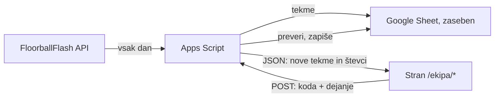

# FBK Loka – spletna stran: build spec v4

Dokument je navodilo za Claude Code. Iz njega mora biti mogoče zgraditi stran brez dodatnih vprašanj.
Kjer podatek manjka, je označen s `TODO:` in ima določeno začasno vrednost.

Jezik strani: slovenščina. Koda, imena datotek in komentarji v kodi: angleščina.

**Spremembe v2:** popravljena logika "Danes igramo" (brskalnik, ne build), preusmeritve in bash v Actionu;
dodani testi, članarina in pogosta vprašanja na `/vpis`, klubski računi; odstranjeni rezultat v živo,
samodejni uvoz IG novic, `EmptyGuard` in dodatni filtri; določeno gibanje; dodana začetna vsebina iz Instagrama (poglavje 18).

**Spremembe v3:** plato in prevoz sta del te strani kot skriti strani `/ekipa/*` (Google Form + Sheet + Apps Script, poglavje 19). Ločena aplikacija v Dockerju odpade.

**Spremembe v4 (po pregledu):** HSTS brez `includeSubDomains` do preverbe DNS; CSP najprej Report-Only, brez `'unsafe-inline'` za skripte;
nov token `--color-input-border` (stari rob polj je imel 1,30:1); build ukaz `npm run verify` s preverbami (13.5);
mobilni wireframe in tri glavne naloge (9.5); načrt fotografij (9.1a); `latin-ext`; plato in prevoz z lastnim obrazcem na strani
namesto Google Forms (19); `docs/01-brief.md` in `CLAUDE.md`.

---

## 0. Kako delaš (za Claude Code)

1. Gradi **po fazah** (poglavje 15). Po vsaki fazi se ustavi, izpiši kaj je narejeno in kako to preverim.
2. Vsaka faza ima definicijo "narejeno". Faza ni končana, dokler ta ne drži.
3. Najmanjša sprememba, ki reši nalogo. Brez dodatnih knjižnic, če jih naloga ne zahteva.
4. Pri vsakem popravku pokaži celotno spremenjeno datoteko s komentarji.
5. Predpostavke vedno izpiši. Če nekaj ni jasno, vprašaj, ne ugibaj.
   Pred kodo, ki uporablja Astro API (collections, slike, config, CSP), preveri trenutno verzijo prek `astro-docs` MCP.
   Namen in merila uspeha so v `docs/01-brief.md`; ko je odločitev nejasna, velja tisto, kar bolj pomaga nalogam iz brifa.
6. Po vsakem zaključenem koraku predlagaj commit sporočilo (lastnik naredi `git push` po vsakem koraku).
7. Za vsak korak najprej zapiši kratek plan v obliki `korak → preverim: ...` in ponavljaj, dokler preverjanje ne uspe.
8. Ne dodajaj funkcij, ki niso v tem dokumentu. Če vidiš preprostejšo pot, jo predlagaj, ne uvedi je sam.
9. Različice paketov: uporabi zadnjo stabilno. Za Astro, Tailwind, Decap in Meta API preveri trenutno
   dokumentacijo, preden pišeš konfiguracijo. Ta dokument ne zaklepa verzij.

---

## 1. Projekt

**Klub:** FBK Loka, floorball klub iz Škofje Loke.
**Domača dvorana:** Dvorana Poden, Podlubnik 1c, 4220 Škofja Loka.
**Domena:** fbkloka.si (trenutno one-pager na drugem strežniku, se zamenja).

### Komu je stran namenjena in kaj mora najti v nekaj sekundah

| Obiskovalec | Kaj išče |
|---|---|
| Starš (obstoječi) | Kdaj in kje je trening, kdaj je tekma, vstop v EOS |
| Starš (nov) | Ali lahko moj otrok začne, koliko je star, kdaj pridemo, kako se vpišemo |
| Igralec, navijač | Razpored, rezultati, lestvica za svojo selekcijo |
| Sponzor, občina | Kaj klub dela, dosežki, zgodovina, kako postati sponzor |

### Temeljno pravilo

**Sekcija brez vsebine se ne prikaže.** Nikoli prazna tabela, nikoli "Kmalu", nikoli "Ni podatkov"
na javni strani. Vsaka komponenta, ki dobi prazen seznam, vrne `null`.

---

## 2. Stack

| Del | Izbira | Opomba |
|---|---|---|
| Framework | Astro (statični output) | Brez SSR. Vse strani so statične. |
| Stil | Tailwind CSS (v4, prek Vite plugina) | Tokeni v `@theme` (poglavje 9) |
| Jezik | TypeScript, `strict` | |
| Vsebina | Astro content collections (Content Layer) | Markdown za besedila, JSON/YAML za podatke |
| CMS | Decap CMS | **Faza 2.** V fazi 1 samo strukturiraj vsebino tako, da jo Decap kasneje ureja brez prestrukturiranja. |
| Gostovanje | Netlify (free) | |
| Obrazci | Netlify Forms | Vpis, kontakt, povpraševanje sponzorjev |
| Podatki tekem | FloorballFlash GraphQL | Pobira GitHub Action, ne Netlify build (poglavje 5) |
| Instagram | Meta Graph API | **Faza 2.** Pobira GitHub Action (poglavje 6) |
| Interaktivnost | Vanilla TS v `<script>` | Brez React/Vue. JS samo za: datumsko logiko na naslovnici, filter, zavihke, meni. |
| Razredi | Astro `class:list` | Brez `clsx`. `cva` samo, če gumb dobi več kot dve različici. |
| Testi | `node:test` (vgrajen v Node) | Brez Vitest/Jest. Samo za normalizacijo FF in datumsko logiko. |
| Mobilni meni | Nativni `<dialog>` | Brez knjižnice |
| OG slike tekem | Satori | **Faza 3** |

**Ne uporabljaj:** React, Vue, jQuery, UI knjižnic komponent, CSS frameworkov poleg Tailwinda,
analitike, piškotkov, zunanjih fontov prek CDN (fonti se gostijo lokalno prek `@fontsource-variable`).

---

## 3. Struktura repozitorija

```
/
├─ .github/workflows/
│  ├─ fetch-ff.yml            # cron: FloorballFlash -> src/data/ff/*.json -> commit ob spremembi
│  └─ fetch-instagram.yml     # faza 2
├─ public/
│  ├─ admin/                  # Decap (faza 2)
│  ├─ fonts/ (če ne prek fontsource)
│  ├─ ig/                     # prenesene IG slike (faza 2)
│  └─ favicon.svg
├─ tests/
│  ├─ fixtures/ff-738.json    # shranjen odgovor competitionDetailsTree
│  ├─ normalize.test.ts
│  └─ upcoming.test.ts
├─ scripts/
│  ├─ fetch-ff.ts             # pokliče GraphQL, normalizira, zapiše JSON
│  ├─ scan-fbk-loka.ts        # najde tekmovanja, kjer nastopa FBK Loka (enkrat na sezono)
│  ├─ contrast.mjs            # preveri barvne pare iz 9.2
│  ├─ check-seo.mjs           # preveri zgrajene strani v dist/
│  └─ fetch-instagram.ts      # faza 2 (samo feed, brez uvoza novic)
├─ src/
│  ├─ assets/logo/            # logo-light.svg, logo-dark.svg
│  ├─ components/
│  ├─ content/                # markdown in yaml, ki ga ureja klub
│  ├─ data/
│  │  ├─ ff/                  # generirano, commita ga Action
│  │  └─ instagram.json       # generirano (faza 2)
│  ├─ config/ff.ts            # preslikava selekcija -> tekmovanja
│  ├─ layouts/Base.astro
│  ├─ lib/                    # date format, helperji, tipi
│  ├─ pages/
│  └─ styles/global.css
├─ apps-script/ekipa/        # Apps Script za plato in prevoz (poglavje 19), deploy ročno
│  ├─ Code.gs
│  ├─ Ff.gs
│  ├─ appsscript.json
│  └─ README.md
├─ docs/
│  └─ 01-brief.md             # namen, občinstvo, naloge, merila uspeha
├─ tests/e2e/                 # Playwright + axe (lokalno)
├─ astro.config.mjs
├─ netlify.toml
├─ .htmlvalidate.json
├─ CLAUDE.md                  # kratka pravila za Claude Code
└─ SPEC.md                    # ta dokument
```

---

## 4. Vsebina, ki jo ureja klub (content collections)

Vse zbirke imajo zod shemo v `src/content.config.ts`. Ob napačnem podatku build pade z jasno napako.

### 4.1 `selekcije` (YAML, ena datoteka na selekcijo)

```yaml
# src/content/selekcije/clani.yaml
slug: clani
ime: Člani
vrstniRed: 1
starostniRazpon: "18+"          # prikaz za starše
kapetan: "TODO"                  # ime ali prazno
trenerji: [ "TODO" ]             # reference na zbirko trenerji (slug)
naslovi: []                      # npr. [{ leto: 2009, naziv: "Državni prvaki" }]
kratekOpis: "..."                # 1–2 stavka
prikaziSestavo: true
```

**Začasni seznam selekcij** (TODO: potrdi s klubom za 2026/27):

| slug | ime | tekmovanja (FloorballFlash) |
|---|---|---|
| `clani` | Člani | 3 Nations – IFL, 1. SFL |
| `svigalice` | Švigalice | 2. SFL (mešana liga). TODO: sestava in trener |
| `u19` | U19 | SLO DP U19 |
| `u17` | U17 (A in B) | SLO DP U17, dve ekipi |
| `u15` | U15 | SLO DP U15 |
| `u13` | U13 | SLO DP U13 |
| `u11` | U11 | SLO DP U11 |

U17 ima dve ekipi v istem tekmovanju (FBK Loka A, FBK Loka B). Na strani selekcije sta dva zavihka.

### 4.2 `treningi` (YAML, en zapis na termin)

```yaml
- selekcija: u15
  dan: ponedeljek          # enum: ponedeljek..nedelja
  od: "17:00"
  do: "18:30"
  dvorana: poden           # referenca na zbirko dvorane
  opomba: ""               # neobvezno
```

Iz te ene zbirke se zgradita: tabela na `/treningi` in urnik na strani vsake selekcije.

### 4.3 `trenerji`

```yaml
slug: janez-novak
ime: Janez Novak
vloga: Glavni trener      # prosto besedilo
foto: ./janez-novak.jpg   # neobvezno
email: ""                 # neobvezno, prikaže se samo, če je izpolnjeno
```

### 4.4 `dvorane`

```yaml
slug: poden
ime: Dvorana Poden
naslov: Podlubnik 1c, 4220 Škofja Loka
zemljevid: "https://maps.google.com/?q=..."   # povezava, ne vgrajen iframe
```

### 4.5 `igralci` (ročni dodatki k podatkom iz FloorballFlash)

FloorballFlash za IFL nima številk in pozicij. Te vpiše klub.

```yaml
slug: maj-oman
ime: Maj Oman              # mora se ujemati z imenom v FloorballFlash za povezavo statistike
selekcija: clani
stevilka: 0                # TODO
pozicija: napadalec        # enum: vratar | branilec | napadalec
foto: ./maj-oman.jpg       # neobvezno
letnik: 2002               # prikaže se SAMO, če je igralec polnoleten
aktiven: true              # false = skrij s strani (npr. po preklicu privolitve)
```

**Pravilo za mladoletne:** letnik se ne prikaže, če je igralec mlajši od 18 let na dan builda.
Nikoli se ne prikaže šola, kontakt ali naslov.

### 4.6 `novice` (Markdown)

```md
---
naslov: "Zmaga v Érdu"
datum: 2026-09-20
povzetek: "Člani so na gostovanju premagali Phoenix Fireball 12:6."
naslovnaSlika: ./erd.jpg
selekcija: clani          # neobvezno, za filtriranje na strani selekcije
vir: instagram            # neobvezno: instagram | facebook | rocno
---
Besedilo novice.
```

### 4.7 Ostale zbirke

| Zbirka | Vsebina |
|---|---|
| `sponzorji` | ime, logo (SVG ali PNG), povezava, raven (glavni / zlati / podporni) |
| `zgodovina` | leto, dogodek, neobvezna fotka, neobvezna `opomba`. Vnos z opombo, ki vsebuje `TODO`, se ne prikaže. |
| `dokumenti` | naslov, kategorija (pravila, obrazci, klubski), povezava ALI lokalna datoteka |
| `strani` | Markdown za `/klub`, `/kodeks`, `/zasebnost`, `/podpri-nas` |
| `nastavitve` | ena YAML datoteka: kontakt, e-mail, telefon, socialna omrežja, EOS povezave, povezava na plato/prevoz |

```yaml
# src/content/nastavitve/site.yaml
imeKluba: FBK Loka
email: "TODO"
telefon: "TODO"
naslov: "TODO"
eos:
  portal: "TODO"             # gumb "Za starše in člane"
  registracija: "TODO"       # gumb "Vpiši se" na /vpis
socialna:
  instagram: https://www.instagram.com/fbk_loka/
  facebook: https://www.facebook.com/FloorballInsport   # TODO: potrdi, da je uradna
```

---

## 5. FloorballFlash

### 5.1 Kaj je znano

- Neuradni GraphQL API: `POST https://internal.floorballflash.at/`, `Content-Type: application/json`.
- Stari REST (`/rest/main/screen/competition/{id}/games`) ne deluje več.
- API vrača `access-control-allow-origin: *` (klic iz brskalnika je mogoč).
- Obstaja tudi **uradni javni ICS vir** `https://api.floorballflash.at/v1/games.ics` s filtri (klub, ekipa, tekmovanje) iz vmesnika na FloorballFlash.
  Dogodki so **celodnevni, brez ure začetka** (`DTSTART;VALUE=DATE`), zato ni glavni vir podatkov. Uporaben je kot rezervni vir in za preverjanje.
  `UID` je `game-{id}`, kar se ujema z ID-ji iz GraphQL. Filter za člane: `?teamId=3462&teamId=3597`. Različni tipi filtrov se med seboj sekajo (IN), zato ne kombiniraj `competitionId` in `competitionSeriesId`. ID-ji ekip se vsako sezono spremenijo, zato URL ni primeren za trajno naročnino staršev; za "Dodaj v koledar" ostanejo Google koledarji iz Apps Scripta (stalen URL, z urami). TODO: filtriran URL za FBK Loka in ali obstajajo JSON končne točke pod `/v1`.
- **ID tekmovanja je vezan na sezono. ID ekipe je vezan na tekmovanje.** Ista FBK Loka ima v vsakem
  tekmovanju drug ID in vsako sezono nov ID. Nikoli ne hardcodiraj ID ekipe. Ekipo išči po imenu.
- Organizator 86 = Slovenska floorball zveza. Organizator 55 = avstrijska zveza (IFL).
- Znano za 2026/27: IFL `competitionId: 738`, FBK Loka `teamId: 3462`. 1. SFL ("SLO 1.SFL - DP VF", serija `85`): FBK Loka `teamId: 3597`, `competitionId` TODO. Mladinska tekmovanja 2026/27 še niso vnesena.
- Slovenska tekmovanja 2026/27 še niso vnesena (TODO). Ko bodo, jih najde `scan-fbk-loka.ts`.

### 5.2 Konfiguracija

```ts
// src/config/ff.ts
export type FfCompetition = {
  competitionId: number | null;   // null = še ni znano, selekcija se prikaže brez tekem
  label: string;                  // prikaz na zavihku, npr. "IFL"
  teamNames: string[];            // točna imena v FF, npr. ["FBK Loka"] ali ["FBK Loka A"]
};

export const FF_CONFIG: Record<string, FfCompetition[]> = {
  clani: [
    { competitionId: 738, label: "IFL", teamNames: ["FBK Loka"] },
    { competitionId: null, label: "1. SFL", teamNames: ["FBK Loka"] },   // TODO: tekmovanje "SLO 1.SFL - DP VF" 2026 že obstaja (ekipa 3597, serija 85). ID poišči s scan-fbk-loka.ts
  ],
  u17: [
    { competitionId: null, label: "U17 A", teamNames: ["FBK Loka A"] },  // TODO
    { competitionId: null, label: "U17 B", teamNames: ["FBK Loka B"] },  // TODO
  ],
  // ostale selekcije: competitionId null, dokler zveza ne vnese sezone
};
```

### 5.3 Poizvedba za razpored in rezultate

```graphql
query competitionDetailsTree($competitionId: Int!) {
  competitionDetails(competitionId: $competitionId) {
    id
    name
    teams { id name shortName logo }
    phases {
      id name mode order
      groups {
        id name order
        rounds {
          id name order
          games {
            id
            state
            home { id goals comment }
            away { id goals comment }
            venue { id name address { street number postCode city country } }
            schedule {
              date { year month day }
              time { hour min sec }
              timezone
            }
          }
        }
      }
    }
  }
}
```

Telo zahteve: `{ "operationName": "competitionDetailsTree", "query": "...", "variables": { "competitionId": 738 } }`.

Opažanja iz dejanskih odgovorov:
- `state`: `"BeforeGame"` ali `"Finished"` (drugih vrednosti še nismo videli, obravnavaj neznane kot "BeforeGame").
- Končnica ima placeholder tekme: `home.id === null`, `comment` npr. `"Winner Semi 1"`, `venue: null`, `time: null`. **Te izloči.**
- Ime ekipe v tekmi je v `home.comment` / `away.comment`. Zanesljivejše je ime iz `teams[]` prek ID-ja.
- `logo` je relativna pot. Polni URL: `https://storage.googleapis.com/floorballflash.appspot.com/` + `logo`.
- `timezone` je `"Europe/Vienna"`, ki ima enak zamik kot Ljubljana. Čas pretvori z upoštevanjem cone
  (knjižnica `date-fns-tz` ali `Temporal` polyfill), ne z `Date.UTC`.
- Povezava na tekmo: `https://www.floorballflash.at/game/{id}`.

### 5.4 Normaliziran format (kar zapiše `fetch-ff.ts`)

```ts
// src/lib/types.ts
export type Match = {
  id: number;                 // FF game id
  selekcija: string;          // slug
  tekmovanje: string;         // label iz konfiguracije, npr. "IFL"
  zacetek: string;            // ISO 8601 z zamikom, npr. "2026-10-10T17:00:00+02:00"
  doma: boolean;              // ali FBK Loka igra doma
  ekipaLoka: string;          // "FBK Loka A"
  nasprotnik: { ime: string; logo: string | null };
  prizorisce: { ime: string; kraj: string; naslov: string } | null;
  stanje: "prihodnja" | "koncana";
  rezultat: { loka: number; nasprotnik: number } | null;   // samo pri "koncana"
  faza: string;               // ime faze, npr. "Qualification Round"
  ffUrl: string;
};
```

Izhod: `src/data/ff/matches.json` (vse tekme vseh selekcij, urejene po `zacetek`) in
`src/data/ff/meta.json` (`{ fetchedAt, competitions: [{ competitionId, name, ok }] }`).

### 5.5 Pravila za `fetch-ff.ts`

1. Za vsak vnos v `FF_CONFIG` z `competitionId !== null` pokliči poizvedbo. Med klici 300 ms premora.
2. Ekipo FBK Loka poišči v `teams[]` po `teamNames` (točno ujemanje). Če je ni, zapiši opozorilo in nadaljuj.
3. Sploščij `phases → groups → rounds → games`, izloči placeholderje, obdrži samo tekme z našo ekipo.
4. **Če katerikoli klic spodleti, ne prepiši obstoječega JSON-a za to tekmovanje.** Obdrži zadnje dobre podatke.
5. Ko so vsi klici neuspešni, skripta konča z izhodno kodo 1 (GitHub pošlje e-mail lastniku repoja).
6. Zapiši datoteko samo, če se vsebina spremeni (brez spremembe ni commita in ni builda).
7. Normalizacija je čista funkcija `normalize(details, config) => Match[]`, ločena od omrežja, da jo lahko testiraš.

**Testi (`tests/normalize.test.ts`, fixture iz dejanskega odgovora za tekmovanje 738):**
- placeholder tekme končnice (`home.id === null`) so izločene,
- `doma` je pravilen za tekmo 16493 (FBK Loka doma) in 16450 (FBK Loka v gosteh),
- tekma 16496 (FBK Loka – FBC Dragons, **25. 10. 2026 ob 13:00, dan premika ure**) ima `zacetek` `2026-10-25T13:00:00+01:00`,
- tekma 16494 (10. 10. 2026 ob 17:00, poletni čas) ima `+02:00`,
- končana tekma 16458 ima `rezultat: { loka: 13, nasprotnik: 6 }`.

### 5.6 GitHub Action

```yaml
# .github/workflows/fetch-ff.yml
name: fetch-floorballflash
on:
  schedule:
    - cron: "0 4 * * *"           # vsak dan ob 06:00 po lokalnem času (poleti)
    - cron: "0 10-21/2 * * 6,0"   # ob sobotah in nedeljah vsaki 2 uri 12:00–23:00
  workflow_dispatch: {}
permissions:
  contents: write
jobs:
  fetch:
    runs-on: ubuntu-latest
    steps:
      - uses: actions/checkout@v4
      - uses: actions/setup-node@v4
        with: { node-version: 22 }
      - run: npm ci
      - run: npx tsx scripts/fetch-ff.ts
      - name: Commit if changed
        run: |
          git config user.name "ff-bot"
          git config user.email "ff-bot@users.noreply.github.com"
          git add src/data/ff
          git diff --cached --quiet || (git commit -m "data: update FloorballFlash" && git push)
```

GitHub ustavi načrtovane Actione v javnih repozitorijih po 60 dneh brez aktivnosti. Preveri po prvem poletju, ali cron še teče.

Commit sproži Netlify build. Ker se commita samo ob spremembi, gradimo le, ko se rezultat res spremeni
(Netlify free ima 300 build minut na mesec).

### 5.7 `scan-fbk-loka.ts` (enkrat na sezono, ročno)

Za organizatorje `[55, 86]` pokliče `competitionsCurrentSeason(organizerId)`, za vsako tekmovanje
`competitionDetailsTree` in izpiše vsa tekmovanja, kjer se ime ekipe začne s `"FBK Loka"`.
Izhod lastnik prepiše v `src/config/ff.ts`.

```graphql
query competitionsCurrentSeason($organizerId: Int) {
  competitions: competitionsCurrentSeason(organizerId: $organizerId) { id name season }
}
```

### 5.8 Faza 3: lestvica, statistika, rezultat v živo

- **Lestvica** in **statistika igralcev**: poizvedbi še nista znani. TODO: lastnik ujame Payload in
  Response v DevTools na `/competition/738/standings` in na strani igralca. Do takrat teh zavihkov ni.
- **Rezultata v živo ne gradimo.** Na dan tekme vrstica tekme dobi gumb "V živo na FloorballFlash" (`ffUrl`).

---

## 6. Instagram (faza 2)

- Na naslovnici zadnjih 6 objav `fbk_loka`, vsaka vodi na objavo na Instagramu.
- Izvoz podatkov kaže, da je račun profesionalen (ima statistiko) in da objave prihajajo tudi s Facebooka. Pogoj za API je verjetno izpolnjen. TODO: preveri povezavo s FB stranjo.
- Pogoj: račun je Business ali Creator, povezan s FB stranjo, Meta aplikacija z dolgoživim žetonom.
  TODO: preveri trenutni Meta postopek (Instagram API with Instagram Login ali prek Facebook Login).
- `fetch-instagram.ts` v GitHub Actionu enkrat dnevno:
  1. prebere zadnjih 6 objav (id, caption, media_type, media_url ali thumbnail_url, permalink, timestamp),
  2. slike prenese v `public/ig/{id}.jpg` (povezave Meta CDN potečejo),
  3. zapiše `src/data/instagram.json`,
  4. osveži žeton, preden poteče (velja 60 dni),
  5. ob napaki pusti stare podatke in konča z izhodno kodo 1.
- Skrivnosti: `IG_USER_ID`, `IG_ACCESS_TOKEN` kot GitHub Secrets. Nikoli v repo.
- **Samodejnega uvoza v novice ne gradimo.** Novice piše urednik v Decap.

---

## 7. Strani

Glavni meni: **Domov, Klub, Ekipe, Tekme, Treningi, Vpis, Novice, Kontakt**.
Desno v glavi: gumb **Za starše in člane** (EOS portal).

Strani `/ekipa/*` niso v meniju, nogi, sitemapu ali kjerkoli drugje na javni strani (poglavje 19).

| Pot | Faza | Vir |
|---|---|---|
| `/` | 1 | FF, novice, IG, sponzorji |
| `/klub` | 1 | `strani`, `trenerji`, `dvorane` |
| `/ekipe` | 1 | `selekcije` |
| `/ekipe/[slug]` | 1 | `selekcije`, FF, `treningi`, `igralci` |
| `/tekme` | 1 | FF |
| `/treningi` | 1 | `treningi` |
| `/vpis` | 1 | `strani`, Netlify Forms, EOS |
| `/kontakt` | 1 | `nastavitve`, Netlify Forms |
| `/zasebnost` | 1 | `strani` |
| `/hvala` | 1 | statika |
| `/404` | 1 | statika |
| `/novice`, `/novice/[slug]` | 2 | `novice` |
| `/dokumenti` | 2 | `dokumenti` |
| `/podpri-nas` | 2 | `strani`, `sponzorji`, Netlify Forms |
| `/kodeks` | 2 | `strani` |
| `/o-floorballu` | 2 | `strani` (za starše: kaj je floorball, pravila, oprema) |
| `/ekipa/plato`, `/ekipa/prevoz` | 2 | Apps Script (skrito, koda) |
| `/zgodovina` | 3 | `zgodovina` |
| `/igralci/[slug]` | 3 | `igralci`, FF statistika |

Stran iz faze, ki še ni zgrajena, ni v meniju.

### 7.1 `/` Domov

Namen: v 3 sekundah pokaže, kdaj je naslednja tekma, in pripelje novega starša do vpisa.

1. **Tekmovalna tabla (hero).** Edini "glasen" element strani. Črno ozadje, vzorec lukenj žogice,
   naslednja tekma katerekoli selekcije: selekcija, nasprotnik, datum, ura, dvorana, odštevanje.
   Na dan tekme napis "Danes igramo". Brez prihodnjih tekem: zadnji rezultat. Brez vsega: poziv za vpis (točka 3) kot hero.

   **Datumska logika teče v brskalniku, ne ob buildu.** Build se zgodi samo ob spremembi podatkov, zato bi bil
   "danes" ali odštevanje, izračunano ob buildu, napačen. HTML vsebuje naslednjih 5 tekem z atributom `data-start` (ISO).
   Skripta ob nalaganju in vsako minuto: skrije tekme, ki so se začele pred več kot 3 urami, izbere prvo naslednjo
   za tablo, označi "Danes igramo" in izračuna odštevanje. Brez JS se pokaže prva tekma iz HTML z datumom, brez odštevanja.
   Logika je v `src/lib/upcoming.ts` (čista funkcija `pick(matches, now)`) in ima teste.
2. **Naslednje tekme.** Do 5 prihodnjih tekem vseh selekcij, vrstica na tekmo. Povezava "Vse tekme".
3. **Poziv za vpis.** Kratek stavek, letniki (TODO), "Prvi trening je brezplačen" (TODO: potrdi), gumb "Vpiši otroka".
4. **Zadnje novice.** 3 najnovejše (faza 2, skrito dokler ni 3 objav).
5. **Instagram.** 6 objav (faza 2).
6. **Sponzorji.** Pas z logotipi v nogi vsake strani, ne samo na naslovnici.

### 7.2 `/ekipe/[slug]`

```
┌───────────────────────────────────────────────────────────┐
│ Člani                                           (naslov)  │
│ ─────                                                     │
│ ┌──────────────┐  ┌─────────────────────────────────────┐ │
│ │ Trener       │  │ [IFL] [1. SFL]      ← tekmovanja    │ │
│ │ Kapetan      │  │ [Tekme] [Lestvica] [Sestava]        │ │
│ │ Treningi     │  │                                     │ │
│ │  pon 19–21   │  │  sob 10. 10.  17:00  doma           │ │
│ │  sre 20–22   │  │  FBK Loka – KAC Floorball           │ │
│ │ Naslovi: 8   │  │  ─────────────────────────────      │ │
│ │ [Dodaj v     │  │  ...                                │ │
│ │  koledar]    │  │                                     │ │
│ └──────────────┘  └─────────────────────────────────────┘ │
└───────────────────────────────────────────────────────────┘
Mobilno: povzetek nad zavihki, zavihki vodoravno drsni.
```

- Zavihki tekmovanj samo, če jih je več kot eno.
- Zavihek **Tekme**: prihodnje zgoraj, spodaj končane (najnovejše prve). Rezultat z vidika FBK Loke.
- Zavihek **Lestvica**: faza 3.
- Zavihek **Sestava**: iz `igralci`, samo `aktiven: true`, razvrščeno vratarji, branilci, napadalci.
- **Dodaj v koledar**: povezava na javni Google Koledar selekcije (TODO: URL-ji koledarjev). Brez URL-ja gumba ni.
- Zavihki morajo delovati brez JS (privzeto odprt prvi, vsebina ostalih je v HTML). JS samo preklaplja.

### 7.3 `/tekme`

- Dve sekciji: **Prihodnje** (zgoraj) in **Odigrane** (najnovejše prve). Znotraj grupirano po tednih.
- En filter: selekcija (`?s=u15`). Brez JS so prikazane vse tekme.
- Vrstica: datum, ura, selekcija, tekma (domači – gostje), dvorana, rezultat ali "Podrobnosti" (FF povezava).

### 7.4 `/treningi`

Ena tabela, grupirana po selekcijah: selekcija, dan, ura, dvorana (povezava na zemljevid), trener.
Mobilno: kartica na selekcijo, ne vodoravno drsenje tabele.

### 7.5 `/vpis`

- Za koga: letniki, ki jih klub sprejema (TODO), kje in kdaj so treningi za začetnike.
- Kaj otrok potrebuje na prvem treningu (TODO od kluba).
- Glavni gumb **Vpiši se** vodi na EOS registracijo (`nastavitve.eos.registracija`).
- **Članarina:** znesek ali stavek "Članarina se ureja v EOS" (TODO od kluba).
- **Pogosta vprašanja** (`<details>`): kaj otrok potrebuje (oprema, palica), koliko stane, od katere starosti,
  ali se lahko pridruži med sezono, kaj če otrok še ni nikoli igral. Odgovori TODO od kluba.
- Pod njim kratek obrazec **Imam vprašanje** (Netlify Forms): ime starša, e-mail, letnik otroka, sporočilo.
  Po oddaji `/hvala`. Honeypot polje. Povezava na `/zasebnost` pod gumbom.

### 7.6 `/klub`

O klubu (Markdown), vodstvo, trenerji (kartice s fotko), dvorana Poden z naslovom in povezavo na zemljevid.
V fazi 3 povezava na `/zgodovina`.

### 7.7 `/kontakt`

Splošni kontakt, odgovorne osebe po selekcijah, obrazec (ime, e-mail, zadeva, sporočilo), socialna omrežja.
Kontakt je dosegljiv z enim klikom z vsake strani (noga).

### 7.8 Faza 2 in 3

- `/novice`: seznam, filter po selekciji. `/novice/[slug]`: naslov, datum, slika, besedilo, povezava nazaj.
- `/dokumenti`: kategorije, povezave na vire pri FZS in IFF. Lokalno samo klubski dokumenti.
- `/podpri-nas`: zakaj podpreti klub, doseg (TODO številke), sponzorski paketi, obrazec za povpraševanje,
  donacija dela dohodnine (TODO: ali je klub upravičenec).
- `/kodeks`: kdo vodi katero ekipo, pravila ravnanja do otrok, kontakt za prijavo težav.
- `/zgodovina`: navpična časovnica, leto levo, dogodek desno. Znano: InSport Škofja Loka, 8 državnih
  naslovov do 2009 (TODO: potrdi, da je to predhodnik kluba, in dopolni leta).
- `/igralci/[slug]`: fotka, ime, številka, pozicija, statistika po tekmovanjih.

---

## 8. Komponente

| Komponenta | Namen |
|---|---|
| `Header` | Logo (temna različica), meni, gumb EOS, mobilni meni |
| `Footer` | Kontakt, socialna omrežja, pas sponzorjev, povezave na `/zasebnost` in `/kodeks`, besedilo "Član Floorball zveze Slovenije" s povezavo na floorballslo.si. Logo zveze samo z dovoljenjem (TODO) in po njihovi celostni podobi: na črni nogi **alternativna različica brez napisa**, prazen prostor okoli logotipa vsaj 1/4 njegove širine, brez spreminjanja barv |
| `MatchBoard` | Hero z naslednjo tekmo in odštevanjem |
| `MatchRow` | Ena tekma v seznamu |
| `MatchList` | Seznam tekem z grupiranjem |
| `TeamSummary` | Levi stolpec na strani selekcije |
| `Tabs` | Dostopni zavihki (ARIA `tablist`), delujejo brez JS |
| `TrainingTable` | Urnik treningov |
| `RosterList` | Sestava |
| `NewsCard` | Novica v seznamu |
| `InstagramGrid` | 6 objav |
| `SponsorStrip` | Logotipi sponzorjev |
| `CalendarButton` | "Dodaj v koledar" |

---

## 9. Dizajn

### 9.1 Smer

Klubske barve so **črna in rumena**. Črna je dominantna, rumena je samo poudarek. Rumeno barvo uporablja
tudi sosednji FBC Žiri, zato razlikovanje dela črna in motiv žogice iz loga.

**En sam drzen element:** tekmovalna tabla na naslovnici. Vse ostalo je mirno, belo, urejeno.

**Anti-generic preverba:** "skoraj črna + en sam živ poudarek" je pogost AI vzorec. Tu je utemeljen, ker sta to
klubski barvi (logo, dresi, objave na IG). Ker barva sama ne dela prepoznavnosti, jo morajo nositi:
1. vzorec lukenj žogice iz loga (samo na tabli),
2. prave fotografije iz dvorane Poden in s tekem,
3. široka razširjena Archivo, ki odmeva napis v logu.
Brez teh treh bi stran izgledala kot katerakoli predloga.

### 9.1a Fotografije

Stran ob lansiranju potrebuje vsaj te posnetke. IG slike so kvadratne in nizke ločljivosti, zato niso dovolj za glavne sloge.

| Posnetek | Kje | Razmerje | Opomba |
|---|---|---|---|
| Članska ekipa na Podnu | `/klub`, OG slika | 3:2, ≥ 2000 px | Skupinska, v dresih |
| Akcija s tekme (3–4) | `/ekipe/[slug]`, novice | 3:2 | Na domači tekmi, z navijači v ozadju |
| Trenerji (portret) | `/klub`, `TeamSummary` | 4:5 | Enako ozadje za vse |
| Otroci na treningu (2) | `/vpis` | 3:2 | Samo z obstoječo privolitvijo |
| Dvorana od zunaj | `/klub`, `/treningi` | 3:2 | Za nove starše: kam pridem |

Predlog: en fotografiran večer na domači tekmi (npr. 10. 10. proti KAC) pokrije večino seznama.
Do takrat se namesto manjkajoče fotke **ne** uporabi stock ali IG slika v velikem formatu; sekcija ostane brez slike.
Vse slike gredo skozi `astro:assets` iz `src/`, ne iz `public/`, z odstranjenim EXIF.

### 9.2 Barve

| Token | Hex | Uporaba |
|---|---|---|
| `--color-ink` | `#000000` | Črna iz loga: glava, noga, tabla, glavno besedilo |
| `--color-ball` | `#F2EC55` | Rumena iz loga (TODO: potrdi z originalno datoteko). Gumbi na črni, poudarki, "Danes igramo" |
| `--color-paper` | `#FFFFFF` | Ozadje vsebine |
| `--color-court` | `#F4F4F2` | Izmenične vrstice, ozadje sekcij |
| `--color-muted` | `#5C5C5C` | Datumi, pomožno besedilo (kontrast na beli ≥ 6:1) |
| `--color-line` | `#E2E2DE` | Samo dekorativna ločila in robovi tabel (1,30:1, ni UI meja) |
| `--color-input-border` | `#767676` | Robovi vnosnih polj, izbirnih polj, kontrolnikov (4,54:1 na beli, 4,12:1 na `court`) |

Tokeni so v `@theme` s `--color-*: initial;`, da privzeta Tailwind paleta ni dostopna. Surove hex vrednosti
ali poljubne vrednosti (`text-[#...]`) v komponentah so napaka.

**Preverjeni kontrasti (skripta `scripts/contrast.mjs`, teče v `npm run verify`):**

| Par | Razmerje | Zahteva |
|---|---|---|
| `ink` na `paper` | 21:1 | 4,5 |
| `muted` na `paper` | 6,69:1 | 4,5 |
| `muted` na `court` | 6,07:1 | 4,5 |
| `ball` na `ink` | 16,90:1 | 4,5 |
| `ink` na `ball` | 16,90:1 | 4,5 |
| `input-border` na `paper` | 4,54:1 | 3 |
| `ball` na `paper` | 1,24:1 | **prepovedano** |

**Pravila kontrasta (obvezno):**
- Rumena **nikoli** kot besedilo na beli ali svetli podlagi (kontrast ~1,2:1).
- Dovoljeno: rumeno besedilo na črni, črno besedilo na rumeni.
- Gumb na beli podlagi: črno ozadje, rumeno ali belo besedilo. Gumb na črni podlagi: rumeno ozadje, črno besedilo.
- Vse kombinacije besedila morajo dosegati WCAG AA.

### 9.3 Tipografija

Ena družina: **Archivo** (variabilna, os širine `wdth`). Širina ustvari razliko med naslovi in besedilom.
Razširjena debela Archivo se ujema z napisom "FLOORBALL KLUB" v logu.

| Vloga | Nastavitev |
|---|---|
| Naslovi H1–H2 | Archivo, `wdth` 125, `wght` 800, tesen razmik vrstic (1.05) |
| Naslovi H3, imena ekip | Archivo, `wdth` 112, `wght` 700 |
| Besedilo | Archivo, `wdth` 100, `wght` 400, razmik vrstic 1.6 |
| Številke (rezultati, ure) | Archivo, `font-variant-numeric: tabular-nums`, `wght` 700 |

Lestvica velikosti (rem, desktop / mobilno): 4 / 2.5 (hero), 2.5 / 1.75 (H1), 1.75 / 1.375 (H2),
1.25 / 1.125 (H3), 1.0625 (besedilo), 0.875 (pomožno). Dolžina vrstice besedila največ 70 znakov.

Fonti se gostijo lokalno (`@fontsource-variable/archivo` s širinsko osjo). `font-display: swap`.
Naloži samo podnabora `latin` in `latin-ext` (č, š, ž, Č, Š, Ž). Preload samo ene datoteke, ki je nad pregibom.
Preveri, da paket vsebuje os `wdth`; če je ne, uporabi `@fontsource-variable/archivo/wdth.css` ali enakovreden vnos po dokumentaciji paketa.

### 9.4 Grafični elementi iz loga

- **Luknje žogice:** statičen SVG vzorec (krogi in ovali kot na žogici v logu) v ozadju tekmovalne table,
  rumen na črni, prosojnost ~12 %. Nikjer drugje. Ne animira se.
- **Vodoravna črta:** debela črna črta pod napisom v logu je ločilo pod naslovom H1 na vsaki strani
  (debelina 6 px, širina 64 px, levo poravnana).
- Palica iz loga se ne uporablja kot dekoracija.

### 9.5 Postavitev

- Vsebina levo poravnana, največja širina 1200 px, stranski rob 20 px mobilno, 32 px desktop.
- Glava: črna, 64 px, logo levo, meni desno. Mobilno: logo in gumb za meni, meni se odpre čez celo stran.
- Noga: črna, tri stolpce (kontakt, povezave, socialna), pod njimi pas sponzorjev na beli podlagi.
- Zaobljenost: 0 za tabele in tablo, 6 px za gumbe in fotke. Brez senc, razen fokusa.
- Seznami tekem so vrstice, ne kartice. Kartice samo za novice in trenerje.

**Mobilno najprej.** Naslovnica in stran selekcije se najprej zgradita za 360 px, stolpci se dodajo šele, ko vsebina postane stisnjena.

```text
NASLOVNICA (360 px)
[logo]                    [☰ Meni]      ← črna glava 64 px
─────────────────────────────────
● ○  ●   ○   (luknje, 12 %)          ← tabla, črna
Člani · IFL
FBK Loka – KAC Floorball
sob 10. 10. · 17:00
Dvorana Poden
še 2 dni 4 ure
[ Vse tekme ]                          ← rumen gumb na črni
─────────────────────────────────
Naslednje tekme
▬▬
sob 10. 10. 17:00
Člani · FBK Loka – KAC       Poden
ned 11. 10. 10:00
U15 · Turnir                  Žiri
─────────────────────────────────
Pridruži se nam
Letniki TODO. Prvi trening je brezplačen (TODO).
[ Vpiši otroka ]                       ← črn gumb na beli
─────────────────────────────────
Novice (skrito do 3 objav)
Instagram (faza 2)
─────────────────────────────────
Kontakt · Za starše (EOS)             ← črna noga
[sponzorji]
```

**Tri glavne naloge, preverjene na tem wireframu:**

| Naloga | Pot | Dotiki |
|---|---|---|
| Starš: kdaj je trening U15? | Meni → Treningi → kartica U15 | 2 |
| Nov starš: kako vpišem otroka? | Naslovnica → Vpiši otroka → Vpiši se (EOS) | 2 |
| Navijač: kdaj in kje je naslednja tekma? | Naslovnica, prvi zaslon | 0 |

Če katera od teh nalog na zgrajeni strani rabi več dotikov, je to napaka.

```
NASLOVNICA (desktop)
┌──────────────────────────────────────────────────────────┐
│ [logo]      Domov Klub Ekipe Tekme ...        [Za starše]│  črna
├──────────────────────────────────────────────────────────┤
│ ● ○   ●    ○  (vzorec lukenj)                            │
│  Člani · IFL                                             │  črna
│  FBK Loka – KAC Floorball          SOB 10. 10. 17:00     │  tabla
│  Dvorana Poden                     še 2 dni 4 ure        │
├──────────────────────────────────────────────────────────┤
│ Naslednje tekme                                          │
│ ▬▬                                                       │
│ sob 10. 10. 17:00  Člani  FBK Loka – KAC       Poden     │
│ ned 11. 10. 10:00  U15    Turnir               Žiri      │
├──────────────────────────────────────────────────────────┤
│ Pridruži se nam     Letniki TODO.         [Vpiši otroka]   │
├──────────────────────────────────────────────────────────┤
│ Novice (3)                 │ Instagram (6)               │
├──────────────────────────────────────────────────────────┤
│ kontakt │ povezave │ socialna                             │  črna
│ [sponzor] [sponzor] [sponzor]                            │
└──────────────────────────────────────────────────────────┘
```

### 9.6 Gibanje

Stran je informativna, starši jo obiščejo vsak teden. Gibanje samo tam, kjer potrdi dejanje.

| Element | Gibanje |
|---|---|
| Nalaganje strani, vzorec lukenj | Brez animacije |
| Zavihki, filter | Brez animacije, takojšen preklop |
| Mobilni meni (odpiranje) | `opacity` in `transform: translateY(-8px → 0)`, 220 ms, `--ease-out` |
| Mobilni meni (zapiranje) | Isto obratno, 160 ms (izhod hitrejši od vhoda) |
| Gumbi | `:active { transform: scale(0.97) }`, 120 ms, `--ease-out` |
| Hover na povezavah in gumbih | Samo barva, 150 ms `ease`, samo pod `@media (hover: hover) and (pointer: fine)` |

Pravila: nikoli `transition: all`, vedno naštej lastnosti. Nobena UI animacija ni daljša od 250 ms.
`prefers-reduced-motion: reduce`: premiki izklopljeni, prehodi prosojnosti in barve ostanejo.

```css
--ease-out: cubic-bezier(0.23, 1, 0.32, 1);
--dur-press: 120ms;
--dur-menu-in: 220ms;
--dur-menu-out: 160ms;
```

### 9.7 Česa ne delaj

- ALL CAPS oznake nad naslovi, razmaknjene črke.
- Poudarjanje ene besede v naslovu z drugo barvo ali poševnim.
- Puščice `→` na koncu gumbov in povezav.
- Številčenje 01 / 02 / 03 za vsebino, ki ni zaporedje.
- Enake kartice z enako senco za vse.
- Pikice kot ločilo v metapodatkih (`A · B · C`) več kot na enem mestu.

---

## 10. Besedila

- Slovenščina, stavčna velikost črk (samo prva črka velika), kratki stavki.
- Gumbi povedo, kaj se zgodi: "Vpiši otroka", "Pošlji vprašanje", "Dodaj v koledar", "Vse tekme".
- Datumi: `sob 10. 10.`, polno `sobota, 10. oktober 2026`. Ure: `17:00`. Vse v `Europe/Ljubljana`.
- Rezultat vedno z vidika FBK Loke v seznamih selekcije ("Zmaga 12:6"), v splošnem seznamu domači – gostje.
- Napake v obrazcih povedo, kaj popraviti: "Vpiši e-mail v obliki ime@domena.si".

---

## 11. EOS, plato in prevoz

- **EOS:** klub ga uporablja za člane, starše, prisotnost in vpis. Stran nanj samo povezuje, ničesar ne podvaja.
  Gumb "Za starše in člane" v glavi, gumb "Vpiši se" na `/vpis`.
- **Plato in prevoz:** skriti strani `/ekipa/plato` in `/ekipa/prevoz`, zaščiteni z ekipno kodo. Podrobnosti v poglavju 19.

---

## 12. Zasebnost in podatki igralcev

- Vsi člani imajo podpisano privolitev za objavo in fotografiranje (za mladoletne podpišejo starši).
- Za mladoletne se prikaže: ime, številka, pozicija, statistika, fotka. **Ne:** letnik, šola, kontakt.
- `aktiven: false` skrije igralca povsod (preklic privolitve).
- Obrazci zbirajo samo nujna polja. Pod vsakim obrazcem povezava na `/zasebnost`.
- Brez piškotkov, brez vgrajenih iframov tretjih strani (zemljevid je povezava, ne iframe).
- Analitike ob lansiranju ni. Doseg na `/podpri-nas` temelji na Instagram statistiki. Če klub želi obisk strani,
  uporabi analitiko brez piškotkov (npr. GoatCounter), ki ne rabi pasice. TODO: odločitev kluba.
- `/zasebnost` vsebuje: upravljavec (klub), kateri podatki se zbirajo prek obrazcev, namen, hramba,
  Netlify kot obdelovalec, pravice posameznika, kontakt. TODO: besedilo potrdi klub.

---

## 13. Tehnične zahteve

### 13.1 `netlify.toml`

```toml
[build]
  # verify = astro check + build + html-validate + linkinator + check-seo (13.5).
  # Pokvarjen vnos iz Decap ali napačen podatek ustavi deploy, namesto da gre v živo.
  command = "npm run verify"
  publish = "dist"

[[headers]]
  for = "/*"
  [headers.values]
    # Brez includeSubDomains, dokler ni preverjeno, da VSE poddomene fbkloka.si tečejo na HTTPS
    # (stari VPS). includeSubDomains bi poddomene brez HTTPS zaklenil za eno leto. TODO: preveri DNS.
    Strict-Transport-Security = "max-age=31536000"
    X-Content-Type-Options = "nosniff"
    Referrer-Policy = "strict-origin-when-cross-origin"
    Permissions-Policy = "camera=(), microphone=(), geolocation=()"
    # Faza 1: Report-Only. Brez 'unsafe-inline' za skripte (Astro skripte so bundlane kot datoteke).
    # Ko je konzola na vseh straneh čista, ime glave zamenjaj s Content-Security-Policy.
    # frame-ancestors 'none' nadomesti X-Frame-Options.
    Content-Security-Policy-Report-Only = "default-src 'self'; img-src 'self' data: https://storage.googleapis.com; font-src 'self'; style-src 'self' 'unsafe-inline'; script-src 'self'; connect-src 'self' https://internal.floorballflash.at https://script.google.com https://script.googleusercontent.com; frame-ancestors 'none'; form-action 'self'; base-uri 'self'; object-src 'none'"

# /admin (Decap) v fazi 2 rabi razširjen CSP. Dodaj ločen [[headers]] for = "/admin/*", nikoli ne rahljaj "/*".
```

**Pravilo za skripte:** brez `is:inline` skript. Če jo kakšna komponenta nujno rabi, najprej vprašaj.
`style-src 'unsafe-inline'` ostane, ker Astro vstavlja kritične sloge inline; to je sprejeto tveganje.

### 13.2 SEO

- Vsaka stran ima svoj `<title>` in `meta description`. Vzorec naslova: `Treningi | FBK Loka`.
- Lokalne ključne besede v naslovih in besedilih: "floorball Škofja Loka", "floorball za otroke Škofja Loka".
- JSON-LD: `SportsOrganization` na `/`, `SportsTeam` na `/ekipe/[slug]`, `SportsEvent` za prihodnje tekme.
- `@astrojs/sitemap` (izključi `/ekipa/`), `robots.txt` z `Disallow: /ekipa/`, kanonični URL-ji, OG slika (privzeta s logom na črni).
- Sidrnih povezav stare strani (`/#tekme`) ni mogoče preusmeriti s strežnika, ker del za `#` ne pride do strežnika.
  Preusmeri samo stare poti, če obstajajo (npr. `/index.html` → `/`), s `301` v `netlify.toml`. TODO: seznam poti stare strani.
- Klub je imel prej stran **fbkinsport.si**. Če je domena še v lasti kluba, naj z `301` preusmerja na fbkloka.si (ohrani povezave in iskalniško vrednost). TODO: preveri lastništvo.

### 13.3 Dostopnost in zmogljivost

- WCAG 2.2 AA. Viden fokus: 2 px obroč z 2 px odmikom, rumen na črni, črn na beli. Ne sme se skriti pod glavo (`scroll-margin-top`).
- Prvi element na strani je povezava "Skoči na vsebino". `<html lang="sl">`.
- Cilji dotika vsaj 44 × 44 px na mobilnem.
- Meni, zavihki in filtri delujejo s tipkovnico.
- Slike prek Astro `<Image>`, WebP/AVIF, `loading="lazy"` razen hero.
- Lighthouse na mobilnem: Performance ≥ 90, Accessibility ≥ 95, Best Practices ≥ 95, SEO ≥ 95.
- Brez JS mora vsebina (tekme, treningi, zavihki) ostati berljiva.

### 13.4 Decap CMS (faza 2)

- Admin na `/admin`. Backend GitHub. TODO: preveri trenutno priporočeno avtentikacijo za Decap na Netlify.
- Urejljive zbirke: novice, treningi, trenerji, selekcije, igralci, sponzorji, dokumenti, zgodovina, strani, nastavitve.
- **Ne** urejljivo: `src/data/ff/*`, `src/config/ff.ts`, postavitev strani.
- Vsaka zbirka ima v Decap kratko pomoč (`hint`) v slovenščini.

### 13.5 Kakovostna vrata

`package.json`:

```json
{
  "scripts": {
    "dev": "astro dev",
    "check": "astro check",
    "build": "astro build",
    "test": "node --test --experimental-strip-types tests/",
    "check:contrast": "node scripts/contrast.mjs",
    "check:html": "html-validate \"dist/**/*.html\"",
    "check:links": "linkinator dist --recurse --silent",
    "check:seo": "node scripts/check-seo.mjs",
    "verify": "npm run check && npm test && npm run check:contrast && npm run build && npm run check:html && npm run check:links && npm run check:seo",
    "test:a11y": "playwright test"
  }
}
```

- `scripts/check-seo.mjs` preveri v `dist/`: `<html lang>`, natanko en `<h1>`, `alt` in `width`/`height` na vsaki sliki;
  za strani brez `noindex` še `<title>` (unikaten), `meta description`, canonical, `og:image`. Izpusti `admin/` in `ekipa/`.
- `scripts/contrast.mjs` preveri pare iz tabele v 9.2 in konča z izhodno kodo 1, če kateri pade.
- `.htmlvalidate.json`: `{ "extends": ["html-validate:recommended"] }`. Če pravilo trči z veljavnim Astro izhodom,
  izklopi **samo to pravilo** s komentarjem, zakaj.
- **Playwright + axe** (`@axe-core/playwright`) teče lokalno pred lansiranjem, ne v Netlify buildu. Strani: `/`, `/ekipe/clani`,
  `/tekme`, `/treningi`, `/vpis`, `/kontakt`. Projekti: Pixel 7, Desktop Chrome, iPhone 14. Plus test: mobilni meni se odpre
  z Enter, zapre z Escape, fokus se vrne na gumb.
- Axe brez napak je nujen, ne zadosten. Ročno: samo tipkovnica, 200 % povečava, 320 px širina, `prefers-reduced-motion`.

---

## 14. Začetna vsebina (za razvoj)

Dokler klub ne pošlje vsebine, uporabi jasno označene začasne podatke:
- Selekcije iz tabele v 4.1.
- En trening na selekcijo z `opomba: "TODO"`.
- Tekme IFL iz pravega API-ja (`competitionId: 738`).
- Brez izmišljenih novic, sponzorjev in igralcev. Te sekcije ostanejo skrite (temeljno pravilo).

Začasni podatki imajo v vrednosti `TODO`, da jih je lahko najti z iskanjem.

---

## 15. Faze in "narejeno"

**Lansiranje je po fazi 1.** Fazi 2 in 3 se gradita, ko stran že teče.

**Računi:** GitHub repozitorij (organizacija) in Netlify sta na klubskem e-mailu, lastnik ima dostop kot član. Ne na osebnem računu.

### Faza 1 – MVP

Obseg: struktura, dizajn sistem, strani `/`, `/klub`, `/ekipe`, `/ekipe/[slug]`, `/tekme`, `/treningi`,
`/vpis`, `/kontakt`, `/zasebnost`, `/hvala`, `/404`, FF skripta in Action, `netlify.toml`.

Korak za korakom:
0. Priprava: `claude mcp add --transport http --scope user astro-docs https://mcp.docs.astro.build/mcp` (enkrat na računalnik), `npm create astro@latest` (strict TS), `npx astro add tailwind`, `npx astro add sitemap`, `CLAUDE.md` iz repozitorija, povezava z Netlify. **Narejeno:** Deploy Preview URL deluje.
1. Tokeni, fonti, `Base` layout s skip povezavo, `Header`, `Footer`. **Narejeno:** prazna stran s pravo glavo in nogo pri 360 px in desktopu, tipkovnica deluje, `npm run check:contrast` zeleno.
2. Content collections s shemami in začasno vsebino. **Narejeno:** `npm run build` uspe, napačen YAML vrne jasno napako.
3. `fetch-ff.ts`, `src/data/ff/matches.json` in testi. **Narejeno:** `npm test` zeleno (vključno s tekmo 25. 10.); skripta zapiše tekme IFL za FBK Loka; ob izklopljenem omrežju obdrži stare podatke.
4. Strani `/tekme`, `/ekipe/[slug]`, `/treningi`. **Narejeno:** tekme IFL vidne na obeh straneh, filtri delujejo, prazne sekcije niso izrisane.
5. Naslovnica s tekmovalno tablo in `upcoming.ts`. **Narejeno:** testi `upcoming.ts` zeleni (dan tekme, tekma pred 2 in pred 4 urami, brez tekem); v dev načinu z `?now=2026-10-10T12:00` se pokaže "Danes igramo"; brez JS se pokaže prva tekma z datumom.
6. `/vpis` (s članarino in pogostimi vprašanji), `/kontakt`, obrazci, `/hvala`, `/zasebnost`, `/404`. **Narejeno:** testna oddaja na Netlify pride kot e-mail.
7. GitHub Action, `netlify.toml`, glave, SEO, `npm run verify` kot build ukaz. **Narejeno:** ročni zagon Actiona commita samo ob spremembi; `curl -sI` pokaže vse glave; CSP Report-Only brez kršitev v konzoli na vseh straneh; `npm run test:a11y` zeleno; Lighthouse cilji iz 13.3 doseženi.
8. Po čisti konzoli: preklop CSP iz Report-Only v vsiljenega. Po preverbi DNS: odločitev o `includeSubDomains`.

### Faza 2 – Vsebina

Decap CMS, `/novice`, `/dokumenti`, `/podpri-nas`, `/kodeks`, Instagram feed.
**Narejeno:** urednik brez pomoči objavi novico in spremeni termin treninga; IG feed kaže 6 objav.

Opomba: `/novice` in `/podpri-nas` imata začetno vsebino že pripravljeno (poglavje 18). Lastnik lahko odloči, da se zgradita že v fazi 1.

**Plato in prevoz (poglavje 19)** sta neodvisna od Decap in se lahko gradita vzporedno s fazo 1. Narejeno: glej 19.8.

### Faza 3 – Nadgradnje

Lestvica, statistika igralcev, `/igralci/[slug]`, `/zgodovina`, OG slike tekem (Satori), galerija (če ima lastnika).
**Narejeno:** lestvica in statistika za vse selekcije brez ročnega dela; deljena povezava tekme pokaže OG sliko z ekipama in uro.

### Pogoji za lansiranje (pred prestavitvijo domene)

- [ ] Logo v SVG, svetla in temna različica
- [ ] Tekme vsaj za člane (IFL) se nalagajo same
- [ ] Treningi, trenerji in kontakti za vse selekcije
- [ ] Zasebnost v nogi, obrazec za vpis testiran do prejetega e-maila
- [ ] Vsaka stran ima en jasen naslednji korak
- [ ] Preverjeno na pravem telefonu z mobilnimi podatki, tri naloge iz 9.5 v predvidenem številu dotikov
- [ ] `npm run verify` in `npm run test:a11y` zeleno, ročni pregled s tipkovnico in pri 200 %
- [ ] CSP vsiljen (ne več Report-Only)
- [ ] Vsaj ena prava fotografija ekipe (9.1a)
- [ ] MFA na GitHubu in Netlifyju, domena na imenu kluba
- [ ] Za vsako sekcijo imenovan lastnik v klubu

---

## 16. Predpostavke

- Obstoječi logo in barve ostanejo. Rumena `#F2EC55` je odčitana s posnetka zaslona.
- Klub ostane na EOS za člane, starše in prisotnost.
- Člani igrajo v IFL in 1. SFL, zato stran selekcije podpira več tekmovanj.
- Netlify free zadostuje (en klub, gradnja samo ob spremembi podatkov).
- FloorballFlash API ostane dostopen. Če se spremeni, stran kaže zadnje shranjene podatke.
- Plato in prevoz: ekipna koda zadošča, ker ne gre za osebne račune. Podatki ostanejo v zasebnem Google Sheetu.

## 17. Odprto (TODO od kluba)

- Logo v SVG (originalna datoteka).
- Seznam selekcij 2026/27, trenerji, termini treningov, kapetani.
- Kontaktni podatki, EOS povezavi (portal, registracija).
- Letniki za vpis, ali je prvi trening brezplačen, kaj otrok prinese.
- Zgodovina: leto ustanovitve, naslovi po letih, prejšnja imena kluba.
- Sponzorji z logotipi.
- Kdo je admin FB strani "Floorball Insport" in IG računa (za Meta API).
- Članarina in odgovori za pogosta vprašanja na `/vpis`.
- Sponzorski paketi za `/podpri-nas`.
- Potrditve v `zgodovina.yaml` (vnosi z `opomba: TODO`).
- URL-ji javnih Google Koledarjev po selekcijah (iz obstoječega Apps Scripta).
- ID-ji slovenskih tekmovanj 2026/27 (ko jih zveza vnese).
- Poizvedbi za lestvico in statistiko igralcev (DevTools).
- Vprašaj operaterja FloorballFlash za dokumentacijo javnega API-ja `api.floorballflash.at/v1` (stabilnejše od notranjega GraphQL).
- Besedilo za `/zasebnost` in `/kodeks`.
- Ali ima klub še domeno fbkinsport.si (preusmeritev).
- Dovoljenje za logo Floorball zveze Slovenije v nogi in datoteka alternativne različice logotipa.
- Prošnja zvezi, da na seznamu klubov (floorballslo.si/klubi) posodobi povezavo na fbkloka.si.
- Igralci FBK Loka v reprezentanci za SP 2026 v Tampereju (5.–13. 12. 2026), za novico in stran `/klub`.
- Aktualni igralci in trenerji kluba v članski reprezentanci in strokovnem vodstvu.
- Klubski Google račun za Sheet, Form in Apps Script, ter vsaj dva urednika Sheeta.
- Ekipna koda (štiri naključne besede) in admin skrbnik za popravke.
- Odločitev: rok za odjavo platoja (predlog 24 ur pred tekmo) ali brez roka.

---

## 18. Začetna vsebina iz Instagrama

Iz izvoza Instagram računa `@fbk_loka` (119 objav, 2018–2026), Wikipedije, Gorenjskega glasa in strani Floorball zveze Slovenije je pripravljena začetna vsebina v `src/content/`. Stran floorballslo.si samodejnega branja ne dovoli, zato so podatki zveze iz iskalnih zadetkov.
Uporabljene so samo objave in statistika dosega, brez zasebnih podatkov. Slike so pomanjšane na največ 1600 px
in **brez EXIF podatkov** (vsaj ena izvorna slika je imela GPS koordinate).

| Datoteka | Vsebina | Stanje |
|---|---|---|
| `novice/*.md` (11) | Novice od aprila 2025 do septembra 2026, vsaka z naslovno sliko | Preberi pred objavo |
| `novice/img/*.jpg` | Naslovne slike novic | Pripravljeno |
| `zgodovina/zgodovina.yaml` | Časovnica 1991–2026 (Loka Spiders, Insport, FBK Loka) | Vnosi z `opomba: TODO` potrebujejo potrditev |
| `strani/klub.md` | Osnutek strani O klubu | Osnutek, TODO v komentarjih |
| `strani/podpri-nas.md` | Doseg na Instagramu (26. 6.–23. 9. 2026) za sponzorje | Številke osveži vsako sezono |
| `strani/o-floorballu.md` | Kaj je floorball, za starše | Osnutek |

Ugotovitve iz strani Floorball zveze Slovenije:
- Barve zveze (modra `#0093D0`, zelena `#A0CF67`, temno modra `#22353C`) in pisave (Brandon Grotesque, Open Sans) **ne prevzemamo**. Stran kluba ostane rumeno-črna. Zveza se pojavi le kot logo v nogi.
- EOS Digital je od avgusta 2026 digitalni partner zveze. To potrjuje odločitev, da stran za člane in vpis povezuje v EOS in ga ne podvaja.
- Razpis državnih prvenstev 2026/27 je potrjen 3. 9. 2026. Tekmovanja v FloorballFlash (organizator 86) se pričakujejo kmalu, takrat poženi `scan-fbk-loka.ts`.

Ugotovitve iz objav, ki vplivajo na stran:
- Klub je do približno 2025 nastopal kot **FBK Insport** (FB stran se še imenuje "Floorball Insport"). Besedila uporabljajo "FBK Loka", zgodovina omeni prejšnje ime.
- Klubski barvi v objavah sta rumena in črna, kar potrjuje paleto.
- Mladi nastopajo tudi kot U16 (Prague Games 2026). TODO: ali je U16 ločena selekcija ali del U17.
- Reprezentanti U19 (2026): Tadej Tomažin, Tilen Tomažin, Matija Notar, Bine Lang, Miha Triler, Žak Kankel Kular, Tim Kankel Kular; Gašper Triler pomočnik trenerja. Kandidat za razdelek "Reprezentanti" na `/klub`.

---

## 19. Ekipa: plato in prevoz (skrito, z ekipno kodo)

### 19.1 Namen in pravila

- **Plato:** na vsako tekmo prinese hrano ena oseba. Ko je tekma zasedena, je drugi ne morejo vzeti.
- **Prevoz:** na tekmo lahko vozi več ljudi (več avtov). Ista oseba se na isto tekmo ne more prijaviti dvakrat.
- **Števca:** kolikokrat je kdo prinesel plato in kolikokrat je vozil. Prikazani so vsi aktivni igralci, tudi z 0.
- **Velja samo za člansko ekipo**, v tekmovanjih 3 Nations – IFL in 1. SFL. Mladinske selekcije niso vključene.
- Pri vsaki tekmi je oznaka tekmovanja (`IFL` ali `1. SFL`).

### 19.2 Arhitektura

Obrazec je na strani sami, ne v Google Forms. Stran pošlje dejanje naravnost v Apps Script, ki ga preveri, zapiše v Sheet
in takoj vrne nove podatke. Uporabnik takoj vidi rezultat ("Prijavljen" ali "Tekma je že zasedena").



- Vse na **klubskem** Google računu: Sheet in Apps Script. Ne na osebnem.
- **Sheet se nikoli ne objavi na splet** (vsebuje imena mladoletnih in vožnje). Podatki gredo ven samo prek Apps Scripta s kodo.
- Brez Google Forms, brez baze, brez Netlify Functions, brez dodatnih storitev.
- Sheet ostane mesto, kjer skrbnik ročno popravi napake.

### 19.3 Google Sheet "FBK Loka – plato in prevoz"

| Zavihek | Stolpci | Kdo piše |
|---|---|---|
| `Nastavitve` | `kljuc`, `vrednost`: `competitionIds` (`738` za IFL, 1. SFL TODO: tekmovanje že obstaja, ekipa 3597), `teamNames` (`FBK Loka`), `odjavaRokUr` (npr. `24` ali prazno) | Skrbnik |
| `Igralci` | `ime`, `aktiven` (TRUE/FALSE). Samo članska sestava. | Skrbnik |
| `Tekme` | `id` (FF game id), `zacetek` (ISO z zamikom), `tekmovanje`, `nasprotnik`, `doma` (TRUE/FALSE), `prizorisce` | Apps Script, vsak dan |
| `Prijave` | `casovniZig`, `ime`, `tekmaId`, `vloga` (`plato`/`prevoz`), `akcija` (`prijava`/`odjava`), `status`, `razlog` | Apps Script |

- `status`: `OK`, `zavrnjeno`, `preklicano`. Vrstice se nikoli ne brišejo. Števci štejejo samo `OK`.
- Zavrnjeni poskusi se tudi zapišejo (sled za skrbnika). `razlog`: `koda` se **ne** zapisuje (ne polnimo Sheeta z ugibanjem kode), ostali da: `zasedeno`, `podvojeno`, `ni prijave`, `po roku`, `tekma mimo`, `neznano ime`, `neznana tekma`.
- Skrbnik lahko ročno spremeni `status` ali `ime`. To je uradni način popravka.

### 19.4 Apps Script (`apps-script/ekipa/`)

Projekt je vezan na Sheet. Koda je v repozitoriju, deploy je ročen (kopiraj v urejevalnik ali `clasp push`). Navodila v `README.md`.

**Script Properties (ne v kodi):** `TEAM_CODE`.

**Funkcije:**

1. `refreshMatches()` – časovni sprožilec, vsak dan ob 06:00.
   - Za vsak `competitionId` iz `Nastavitve` pokliče `competitionDetailsTree` (poizvedba iz 5.3, koda v `Ff.gs`, prenesena iz obstoječega `Fetch.gs`).
   - Zapiše prihodnje in pretekle tekme ekip iz `teamNames` v `Tekme` (upsert po `id`). Placeholderje končnice izloči kot v 5.5.
   - Ob napaki pusti obstoječe vrstice in pošlje e-mail skrbniku.
   - Na koncu `CacheService.getScriptCache().remove('data')`.

2. `doPost(e)` – spletna aplikacija, edina vstopna točka za stran.
   - Telo kot `text/plain` (brez preflight zahteve), vsebina JSON.
   - Brez dejanja: `{ "code": "..." }` → vrne podatke.
   - Z dejanjem: `{ "code": "...", "action": { "type": "prijava" | "odjava", "vloga": "plato" | "prevoz", "ime": "...", "tekmaId": 16493 } }`
     → preveri in zapiše, nato vrne `{ "result": { "ok": true } | { "ok": false, "razlog": "zasedeno" }, ...podatki }`.
   - Napačna koda → `{ "error": "bad_code" }`, nič se ne zapiše.
   - Zapis teče pod `LockService.getScriptLock().waitLock(20000)`, sprostitev v `finally`. Ob poteku zaklepa → `{ "error": "busy" }`.
   - Po vsakem zapisu `CacheService.getScriptCache().remove('data')`. Branje brez dejanja se predpomni 60 s (ključ `data`).
   - Objava: "Execute as: Me" (klubski račun), "Who has access: Anyone". Zaščito dela koda.

**Pravila za dejanje (v tem vrstnem redu):**

| Pogoj | Rezultat |
|---|---|
| Ime ni aktivni igralec | `zavrnjeno` / `neznano ime` |
| `tekmaId` ni v `Tekme` | `zavrnjeno` / `neznana tekma` |
| Tekma se je že začela | `zavrnjeno` / `tekma mimo` |
| Prijava, plato, tekma že ima `OK` plato | `zavrnjeno` / `zasedeno` |
| Prijava, isto ime + tekma + vloga že `OK` | `zavrnjeno` / `podvojeno` |
| Prijava, sicer | `OK` |
| Odjava, ni `OK` prijave za ime + tekmo + vlogo | `zavrnjeno` / `ni prijave` |
| Odjava platoja, `odjavaRokUr` nastavljen in do tekme manj ur | `zavrnjeno` / `po roku` |
| Odjava, sicer | najnovejša ustrezna `OK` prijava → `preklicano`; vrstica odjave → `OK` |

Pravila so v čisti funkciji `decide(action, rows, now, settings)` v `Rules.gs`, ki ne kliče Sheeta. Enaka funkcija
je kopirana v `tests/ekipa-rules.test.ts` in testirana z `node:test` (vsaka vrstica tabele en test).

**Oblika odgovora (podatki):**

```json
{
  "generatedAt": "2026-09-24T18:00:00+02:00",
  "igralci": ["Ime Priimek", "Ime Priimek"],
  "tekme": [
    {
      "id": 16493,
      "zacetek": "2026-09-26T17:00:00+02:00",
      "tekmovanje": "IFL",
      "nasprotnik": "VSV Unihockey",
      "doma": true,
      "prizorisce": "Dvorana Poden",
      "plato": "Ime Priimek",
      "prevoz": ["Ime Priimek", "Ime Priimek"]
    }
  ],
  "stevci": {
    "plato":  [{ "ime": "Ime Priimek", "n": 2 }],
    "prevoz": [{ "ime": "Ime Priimek", "n": 5 }]
  }
}
```

- `igralci`: aktivni, po abecedi (za izbiro imena).
- `tekme`: samo prihodnje, urejene po `zacetek`. `plato` je `null`, če je prosto.
- `stevci`: vse tekme sezone, vsi aktivni igralci (tudi `n: 0`), urejeno padajoče po `n`, nato po imenu.

**Omejitve Apps Scripta:** odgovor 1–3 s. Brez zaklepanja poskusov kode, zato mora biti koda dolga (štiri naključne besede).

### 19.5 Strani `/ekipa/plato` in `/ekipa/prevoz`

- Statična lupina, podatki se naložijo v brskalniku. To je edino mesto na strani, ki brez JS ne deluje (sporočilo v `<noscript>`).
- `<meta name="robots" content="noindex, nofollow">`, izključeno iz sitemapa, `Disallow` v `robots.txt`, brez povezav z javnih strani. Povezavo klub deli v ekipni skupini.
- **Koda:** ob prvem obisku obrazec "Ekipna koda". Ob uspehu se koda shrani v `localStorage` (`fbk-ekipa-code`), branje in pisanje v `try/catch`; če shranjevanje ne deluje, se koda vpraša znova. Ob `bad_code` se izbriše in obrazec se pokaže znova s sporočilom "Koda ni pravilna. Preveri jo v ekipni skupini."
- **Moje ime:** ob prvi prijavi uporabnik izbere ime iz seznama; ime se zapomni v `localStorage` (`fbk-ekipa-ime`) z možnostjo "Nisem jaz". Tako naslednjič klikne samo gumb.
- **Nalaganje:** "Nalagam podatke…". Ob napaki: "Podatkov trenutno ni mogoče naložiti. Poskusi znova čez minuto." z gumbom "Poskusi znova".
- Zgoraj preklop med **Plato** in **Prevoz** (povezavi na obe strani).

**`/ekipa/plato`:**

```text
Plato
▬▬
Ti si: Ime Priimek  [Nisem jaz]

sob 26. 9. 17:00 · IFL
FBK Loka – VSV Unihockey · Poden
Prinese: Ime Priimek              [Odjavi]    ← samo, če je to "moje ime"

sob 10. 10. 17:00 · IFL
FBK Loka – KAC Floorball · Poden
Prosto                            [Prinesem jaz]

Kdo je že prinesel
Ime Priimek   3
Ime Priimek   2
Ime Priimek   0
```

**`/ekipa/prevoz`:** enako, pri tekmi seznam voznikov in gumb "Vozim jaz". "Odjavi" je samo ob mojem imenu. Števec "Kdo je že vozil". Pri gostujočih tekmah je kraj poudarjen.

**Obnašanje gumba (`Prinesem jaz`, `Vozim jaz`, `Odjavi`):**
1. Če "moje ime" še ni izbrano, se odpre `<dialog>` z izbiro imena in gumbom "Potrdi".
2. Po kliku: gumb onemogočen, besedilo "Shranjujem…". Drugi gumbi ostanejo aktivni.
3. Uspeh: seznam se na novo izriše iz odgovora, pod tekmo se za 4 s pokaže "Prijavljen" ali "Odjavljen" (`aria-live="polite"`).
4. Zavrnitev: besedilo iz tabele spodaj, seznam se osveži (npr. nekdo je bil hitrejši).
5. Omrežna napaka ali `busy`: "Ni shranjeno. Poskusi znova." in gumb spet aktiven.

| `razlog` | Sporočilo |
|---|---|
| `zasedeno` | "Nekdo je bil hitrejši. Plato za to tekmo je že zaseden." |
| `podvojeno` | "Na to tekmo si že prijavljen." |
| `po roku` | "Odjava ni več mogoča. Piši skrbniku." |
| `tekma mimo` | "Tekma se je že začela." |
| `ni prijave`, `neznano ime`, `neznana tekma` | "Nekaj ni v redu. Osveži stran in poskusi znova." |

- Plato velja za vse tekme, doma in v gosteh (TODO: potrdi, ali samo domače).

Konfiguracija strani:

```ts
// src/config/ekipa.ts
export const EKIPA = {
  appsScriptUrl: "TODO", // URL objavljene spletne aplikacije (ni skrivnost)
};
```

### 19.6 Zasebnost

- Sheet ima najmanj dva urednika na klubskem računu. Ni deljen s povezavo.
- Ekipna koda se menja vsako sezono (Script Property + obvestilo v ekipni skupini).
- Po koncu sezone skrbnik kopira zavihek `Prijave` v arhiv in ga izprazni.
- Na javni strani ni nobenega podatka iz tega sistema. "Moje ime" ostane samo v brskalniku uporabnika.

### 19.7 Kaj Claude Code gradi in česa ne

- **Gradi:** `apps-script/ekipa/*` (`Code.gs`, `Ff.gs`, `Rules.gs`, `appsscript.json`, `README.md`), `tests/ekipa-rules.test.ts`,
  `src/pages/ekipa/plato.astro`, `src/pages/ekipa/prevoz.astro`, `src/config/ekipa.ts`, skripto za nalaganje, prikaz in dejanja, CSP in `robots.txt` spremembe.
- **Ne gradi:** Sheeta (ustvari ga lastnik ročno po `README.md`, ker mora biti na klubskem računu).
- `README.md` vsebuje: ustvarjanje Sheeta z zavihki iz 19.3, Script Properties, namestitev sprožilca, objavo spletne aplikacije in kako URL vpisati v `src/config/ekipa.ts`.

### 19.8 Narejeno

- [ ] `npm test` zeleno za vse vrstice tabele pravil.
- [ ] `refreshMatches()` ročno zagnan: `Tekme` vsebuje prihodnje tekme IFL.
- [ ] Dva brskalnika hkrati kliknita "Prinesem jaz" za isto tekmo: eden dobi "Prijavljen", drugi "Nekdo je bil hitrejši".
- [ ] Odjava platoja: prejšnji vnos `preklicano`, tekma je takoj "Prosto".
- [ ] Napačna koda na strani: sporočilo "Koda ni pravilna", v Sheetu ni nove vrstice.
- [ ] Prevoz: dva voznika na isto tekmo sta oba `OK`, isto ime dvakrat je `podvojeno`.
- [ ] Ročna sprememba `status` v Sheetu se pokaže na strani v največ 60 s.
- [ ] Gumb med shranjevanjem ne sprejme drugega klika; sporočila berejo bralniki zaslona (`aria-live`).
- [ ] `/ekipa/` ni v sitemapu, ima `noindex`, `robots.txt` vsebuje `Disallow: /ekipa/`, iskanje "ekipa" po HTML javnih strani ne najde povezave.
